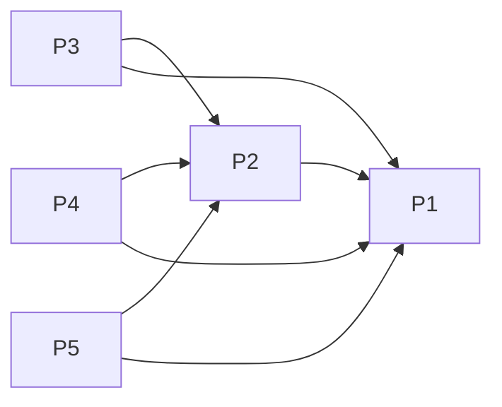

# Projects and dependencies analysis

This document provides a comprehensive overview of the projects and their dependencies in the context of upgrading to .NETCoreApp,Version=v10.0.

## Table of Contents

- [Executive Summary](#executive-Summary)
  - [Highlevel Metrics](#highlevel-metrics)
  - [Projects Compatibility](#projects-compatibility)
  - [Package Compatibility](#package-compatibility)
  - [API Compatibility](#api-compatibility)
- [Aggregate NuGet packages details](#aggregate-nuget-packages-details)
- [Top API Migration Challenges](#top-api-migration-challenges)
  - [Technologies and Features](#technologies-and-features)
  - [Most Frequent API Issues](#most-frequent-api-issues)
- [Projects Relationship Graph](#projects-relationship-graph)
- [Project Details](#project-details)

  - [AzTagger.App/AzTagger.App.csproj](#aztaggerappaztaggerappcsproj)
  - [AzTagger.Core/AzTagger.Core.csproj](#aztaggercoreaztaggercorecsproj)
  - [AzTagger.Gtk/AzTagger.Gtk.csproj](#aztaggergtkaztaggergtkcsproj)
  - [AzTagger.Mac/AzTagger.Mac.csproj](#aztaggermacaztaggermaccsproj)
  - [AzTagger.Wpf/AzTagger.Wpf.csproj](#aztaggerwpfaztaggerwpfcsproj)

## Executive Summary

### Highlevel Metrics

| Metric | Count | Status |
| :--- | :---: | :--- |
| Total Projects | 5 | All require upgrade |
| Total NuGet Packages | 14 | 3 need upgrade |
| Total Code Files | 28 |  |
| Total Code Files with Incidents | 12 |  |
| Total Lines of Code | 5259 |  |
| Total Number of Issues | 41 |  |
| Estimated LOC to modify | 33+ | at least 0,6% of codebase |

### Projects Compatibility

| Project | Target Framework | Difficulty | Package Issues | API Issues | Est. LOC Impact | Description |
| :--- | :---: | :---: | :---: | :---: | :---: | :--- |
| [AzTagger.App/AzTagger.App.csproj](#aztaggerappaztaggerappcsproj) | net9.0 | 🟢 Low | 0 | 12 | 12+ | ClassLibrary, Sdk Style = True |
| [AzTagger.Core/AzTagger.Core.csproj](#aztaggercoreaztaggercorecsproj) | net9.0 | 🟢 Low | 2 | 20 | 20+ | ClassLibrary, Sdk Style = True |
| [AzTagger.Gtk/AzTagger.Gtk.csproj](#aztaggergtkaztaggergtkcsproj) | net9.0 | 🟢 Low | 0 | 1 | 1+ | DotNetCoreApp, Sdk Style = True |
| [AzTagger.Mac/AzTagger.Mac.csproj](#aztaggermacaztaggermaccsproj) | net9.0 | 🟢 Low | 0 | 0 |  | DotNetCoreApp, Sdk Style = True |
| [AzTagger.Wpf/AzTagger.Wpf.csproj](#aztaggerwpfaztaggerwpfcsproj) | net9.0-windows | 🟢 Low | 1 | 0 |  | Wpf, Sdk Style = True |

### Package Compatibility

| Status | Count | Percentage |
| :--- | :---: | :---: |
| ✅ Compatible | 11 | 78,6% |
| ⚠️ Incompatible | 2 | 14,3% |
| 🔄 Upgrade Recommended | 1 | 7,1% |
| ***Total NuGet Packages*** | ***14*** | ***100%*** |

### API Compatibility

| Category | Count | Impact |
| :--- | :---: | :--- |
| 🔴 Binary Incompatible | 0 | High - Require code changes |
| 🟡 Source Incompatible | 18 | Medium - Needs re-compilation and potential conflicting API error fixing |
| 🔵 Behavioral change | 15 | Low - Behavioral changes that may require testing at runtime |
| ✅ Compatible | 7664 |  |
| ***Total APIs Analyzed*** | ***7697*** |  |

## Aggregate NuGet packages details

| Package | Current Version | Suggested Version | Projects | Description |
| :--- | :---: | :---: | :--- | :--- |
| Azure.Identity | 1.14.0 |  | [AzTagger.Core.csproj](#aztaggercoreaztaggercorecsproj) | ⚠️NuGet package is deprecated |
| Azure.ResourceManager | 1.13.1 |  | [AzTagger.Core.csproj](#aztaggercoreaztaggercorecsproj) | ✅Compatible |
| Azure.ResourceManager.ResourceGraph | 1.0.1 |  | [AzTagger.Core.csproj](#aztaggercoreaztaggercorecsproj) | ✅Compatible |
| Azure.ResourceManager.Resources | 1.10.0 |  | [AzTagger.Core.csproj](#aztaggercoreaztaggercorecsproj) | ✅Compatible |
| Eto.Forms | 2.9.0 |  | [AzTagger.App.csproj](#aztaggerappaztaggerappcsproj) | ✅Compatible |
| Eto.Platform.Gtk | 2.9.0 |  | [AzTagger.Gtk.csproj](#aztaggergtkaztaggergtkcsproj) | ✅Compatible |
| Eto.Platform.Mac64 | 2.9.0 |  | [AzTagger.Mac.csproj](#aztaggermacaztaggermaccsproj) | ✅Compatible |
| Eto.Platform.Wpf | 2.9.0 | 2.8.2 | [AzTagger.Wpf.csproj](#aztaggerwpfaztaggerwpfcsproj) | ⚠️NuGet package is incompatible |
| Extended.Wpf.Toolkit | 4.7.25104.5739 |  | [AzTagger.Wpf.csproj](#aztaggerwpfaztaggerwpfcsproj) | ✅Compatible |
| Microsoft.Graph | 5.81.0 |  | [AzTagger.Core.csproj](#aztaggercoreaztaggercorecsproj) | ✅Compatible |
| Microsoft.Identity.Client | 4.72.1 |  | [AzTagger.Core.csproj](#aztaggercoreaztaggercorecsproj) | ✅Compatible |
| Serilog | 4.3.0 |  | [AzTagger.Core.csproj](#aztaggercoreaztaggercorecsproj) | ✅Compatible |
| Serilog.Sinks.File | 7.0.0 |  | [AzTagger.Core.csproj](#aztaggercoreaztaggercorecsproj) | ✅Compatible |
| System.Text.Json | 9.0.6 | 10.0.2 | [AzTagger.Core.csproj](#aztaggercoreaztaggercorecsproj) | NuGet package upgrade is recommended |

## Top API Migration Challenges

### Technologies and Features

| Technology | Issues | Percentage | Migration Path |
| :--- | :---: | :---: | :--- |

### Most Frequent API Issues

| API | Count | Percentage | Category |
| :--- | :---: | :---: | :--- |
| T:System.Uri | 12 | 36,4% | Behavioral Change |
| M:System.TimeSpan.FromMilliseconds(System.Int64,System.Int64) | 8 | 24,2% | Source Incompatible |
| M:System.IO.Path.Combine(System.ReadOnlySpan{System.String}) | 5 | 15,2% | Source Incompatible |
| M:System.TimeSpan.FromSeconds(System.Int64) | 2 | 6,1% | Source Incompatible |
| T:System.BinaryData | 2 | 6,1% | Source Incompatible |
| M:System.Uri.#ctor(System.String) | 2 | 6,1% | Behavioral Change |
| E:System.AppDomain.ProcessExit | 1 | 3,0% | Behavioral Change |
| M:System.BinaryData.ToObjectFromJson''1(System.Text.Json.JsonSerializerOptions) | 1 | 3,0% | Source Incompatible |

## Projects Relationship Graph

Legend:
📦 SDK-style project
⚙️ Classic project

## Project Details

