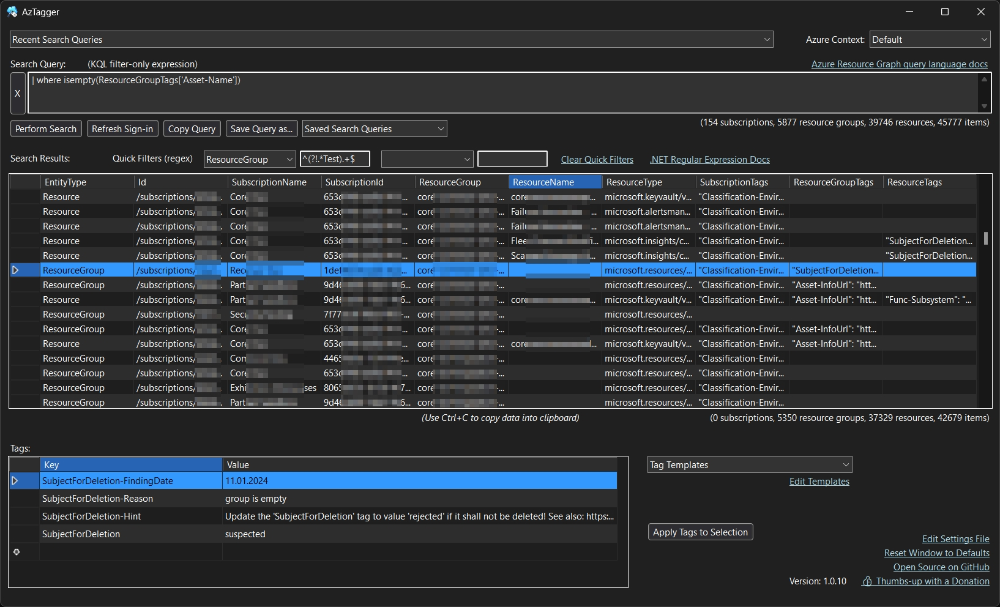

<!-- SHIELDS -->
<div align="center">

[![Contributors][contributors-shield]][contributors-url]
[![Forks][forks-shield]][forks-url]
[![Stargazers][stars-shield]][stars-url]
[![Issues][issues-shield]][issues-url]
[![MIT License][license-shield]][license-url]

</div>

<!-- PROJECT LOGO -->
<br />
<div align="center">
  <a href="https://github.com/thgossler/AzTagger">
    
  </a>

  <h1 align="center">AzTagger</h1>

  <p align="center">
    Query and filter your Azure resources fast and tag them easily.
    <br />
    <a href="https://github.com/thgossler/AzTagger/issues">Report Bug</a>
    ·
    <a href="https://github.com/thgossler/AzTagger/issues">Request Feature</a>
    ·
    <a href="https://github.com/thgossler/AzTagger#contributing">Contribute</a>
    ·
    <a href="https://github.com/sponsors/thgossler">Sponsor project</a>
    ·
    <a href="https://www.paypal.com/donate/?hosted_button_id=JVG7PFJ8DMW7J">Sponsor via PayPal</a>
  </p>
</div>

# Introduction

AzTagger is a cross-platform desktop GUI application for fast and flexible
querying of Azure resources and tag management. It allows fast search and filtering of all
resources, resource groups, and subscriptions using Azure Resource Graph for your Entra ID tenant.
It runs on latst Windows 11 (WPF), macOS (Mac) and Linux (GTK).



## Features

### User Authentication and Tenant Selection

- Interactive sign-in to Entra ID via web browser, support for SSO and multi-factor authentication (MFA)
- Support for multiple parallel Azure contexts including environment (e.g., AzurePublicCloud, AzureChina), Entra ID tenant and app ID

### Search Functionality

- Fast search and filtering of all Azure resources, resource groups, and subscriptions based on in-memory result data from Azure Resource Graph
- A single input field for easy and flexible rmot querying of resources
- Multiple input fields for easy and flexible local quick-filtering of resources
- Comprehensive support of KQL and .NET regular expressions

### Search Results Display

- Support for large numbers of search results
- Column sorting
- Double-click on item to open it in the Azure Portal
- Context menu items to add result values to the search query for filtering
- Full display of all tags of all levels (subscription, resource group, resource) and combined

### Tag Management

- Easy inline editing and deletion of tags in a table
- Add new tags by clicking into the last empty line's key or value cells and start typing
- Use default tag templates and maintain custom ones in a `tagtemplates.json` file in the user's AppData Local folder
- Support of variables in tag template values such as {Date}, {Time}, {DateTime}, {User} 
- Create and update all specified tags on all selected subscriptions, resource groups, and resources at once
- Copy any tag cell value via right-click context menu
- Open all hyperlinks of all tag values of a resource in the browser

### Error Handling and Logging

- All errors logged to `errorlog.txt` files in the user's AppData Local folder.

## Used Technologies

- C# .NET 9
- Eto.Forms, supporting for Windows 11 (WPF), Linux (GTK), and macOS (Mac)
- SeriLog
- Azure Identity
- Azure Resource Manager
- Azure Resource Graph

_Hint for your interest: The migration from a .NET 9 Windows Forms application into a cross-platform .NET 9 Eto.Forms application was done within 3 days with help of OpenAI Codex and then GitHub Copilot using Claude Sonnet 4 (Preview) and GPT 4.1 models._

## Building and Running

Clone the repository and build all projects:

`dotnet build AzTagger.sln -c Release`

### Build and Run for Each Platform

#### Windows

```
dotnet build AzTagger.Wpf/AzTagger.Wpf.csproj -c Release --framework net9.0 --runtime win-x64
dotnet run --project AzTagger.Wpf/AzTagger.Wpf.csproj --framework net9.0 --runtime win-x64
```

#### Linux

```
dotnet build AzTagger.Gtk/AzTagger.Gtk.csproj -c Release --framework net9.0 --runtime linux-x64
dotnet run --project AzTagger.Gtk/AzTagger.Gtk.csproj --framework net9.0 --runtime linux-x64
```

#### macOS

```
Apple Silicon (arm64):
    dotnet build AzTagger.Mac/AzTagger.Mac.csproj -c Release --framework net9.0 --runtime osx-arm64
    dotnet run --project AzTagger.Mac/AzTagger.Mac.csproj --framework net9.0 --runtime osx-arm64

Intel (x64):
    dotnet build AzTagger.Mac/AzTagger.Mac.csproj -c Release --framework net9.0 --runtime osx-x64
    dotnet run --project AzTagger.Mac/AzTagger.Mac.csproj --framework net9.0 --runtime osx-x64
```

### Publish

You can publish self-contained executables for each platform using `dotnet publish` with the same `--framework` and `--runtime` parameters.

## Report Bugs

Please open an issue on the GitHub repository with the tag "bug".

## Donate

If you are using the tool but are unable to contribute technically, please consider promoting it and donating an amount that reflects its value to you. You can do so either via PayPal

[](https://www.paypal.com/donate/?hosted_button_id=JVG7PFJ8DMW7J)

or via [GitHub Sponsors](https://github.com/sponsors/thgossler).

## Contributing

Contributions are what make the open source community such an amazing place to learn, inspire, and create. Any contributions you make are **greatly appreciated**.

If you have a suggestion that would make this better, please fork the repo and create a pull request. You can also simply open an issue with the tag "enhancement".
Don't forget to give the project a star :wink: Thanks!

1. Fork the Project
2. Create your Feature Branch (`git checkout -b feature/AmazingFeature`)
3. Commit your Changes (`git commit -m 'Add some AmazingFeature'`)
4. Push to the Branch (`git push origin feature/AmazingFeature`)
5. Open a Pull Request

## License

This project is licensed under the MIT License - see the [LICENSE](LICENSE) file for details.

<!-- MARKDOWN LINKS & IMAGES (https://www.markdownguide.org/basic-syntax/#reference-style-links) -->
[contributors-shield]: https://img.shields.io/github/contributors/thgossler/AzTagger.svg
[contributors-url]: https://github.com/thgossler/AzTagger/graphs/contributors
[forks-shield]: https://img.shields.io/github/forks/thgossler/AzTagger.svg
[forks-url]: https://github.com/thgossler/AzTagger/network/members
[stars-shield]: https://img.shields.io/github/stars/thgossler/AzTagger.svg
[stars-url]: https://github.com/thgossler/AzTagger/stargazers
[issues-shield]: https://img.shields.io/github/issues/thgossler/AzTagger.svg
[issues-url]: https://github.com/thgossler/AzTagger/issues
[license-shield]: https://img.shields.io/github/license/thgossler/AzTagger.svg
[license-url]: https://github.com/thgossler/AzTagger/blob/main/LICENSE
